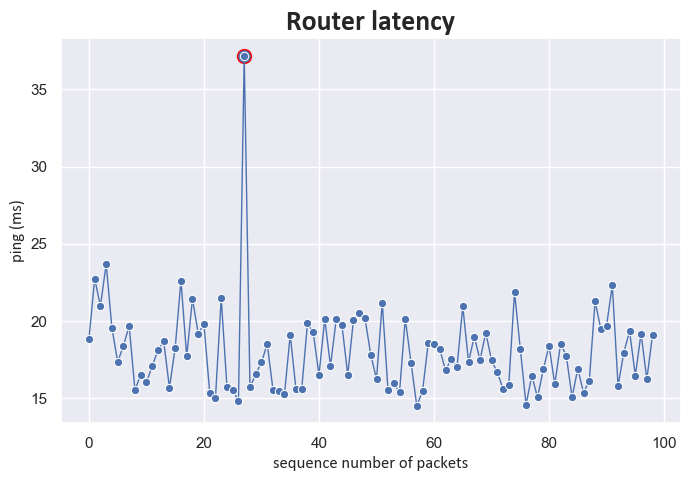

# (Quick) Network Latency Analysis

## Overview

This project analyzes network latency data obtained from a router ping test (with 99 packets transmitted & received) to Google's DNS server (8.8.8.8). 
The primary goal is to identify patterns in packet loss and latency by visualizing sequence numbers and round-trip times. 
The project demonstrates the use of Python for data parsing, cleaning, and analysis, leveraging the pandas, seaborn, and matplotlib libraries 
for data manipulation and visualization.

## Project Structure

- **Data Import**: The data is imported from a text file (`ping_test.txt`) containing ping test results.
- **Data Cleaning**: The raw data is parsed and cleaned to extract relevant information such as sequence numbers and round-trip times.
- **Data Analysis**: Using pandas and matplotlib libraries, the data is analyzed to identify packet loss and latency patterns.
- **Visualization**: The results are visualized through graphs that depict the relationship between sequence numbers and round-trip times.

## Key Results

The analysis provided the following key metrics from the ping test data:

- **Number of packets sent & received**: 99
- **Mean ping**: 18.06 ms
- **Maximum ping**: 37.17 ms
- **Minimum ping**: 14.52 ms

The sudden ping spike (highlighted in red) hints at a latency issue.

## Technologies Used

- **Python**: For data processing, cleaning, and analysis.
- **Pandas**: To handle data manipulation and analysis.
- **Matplotlib**: For data visualization.
- **Seaborn**: For data visualization.
- **Matplotlib.font_manager**: To customize font properties in plots.
